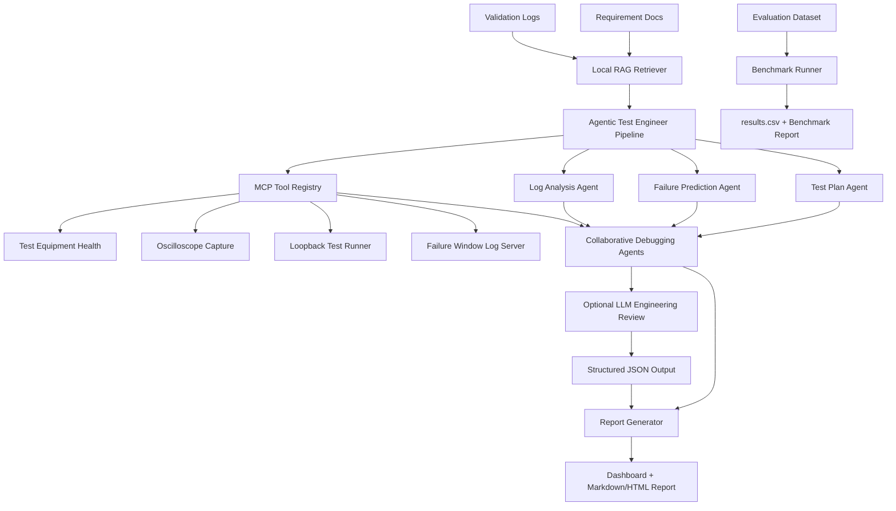

# AI Test Engineer Copilot

An agentic AI copilot for hardware/software validation workflows. The application reads requirement specs and validation logs, generates test plans, predicts failure points, analyzes root causes, invokes MCP-style engineering tools, runs a multi-agent debugging review, and exports debugging reports.

This project is built to align with AI engineering roles focused on AI-assisted testing, LLMs, RAG, MCP, validation automation, failure analysis, and engineering productivity.

## Live Demo

The GitHub repository is the source code. To open the actual web app, deploy it on Render or run it locally.

Local URL after starting the server:

```text
http://127.0.0.1:8000
```

Render will give a public URL after deployment, for example:

```text
https://ai-test-engineer-copilot.onrender.com
```

## Highlights

- Generates validation-ready test plans from requirement/design documents.
- Predicts likely hardware/software failure points.
- Analyzes validation logs for root cause evidence.
- Simulates MCP-style tool calls for lab/test infrastructure.
- Uses RAG-style retrieval over specs and logs.
- Includes a multi-agent debugging workflow with hardware, firmware, validation, and root cause agents.
- Supports optional LangGraph orchestration for the agent workflow.
- Exports Markdown and HTML debugging reports.
- Supports optional OpenAI GPT-4.1 or Gemini LLM review with structured JSON outputs.
- Includes an evaluation dataset, generated CSV results, and a benchmark report.
- Runs without an API key using deterministic local agents.

## Architecture



Optional LangGraph mode uses this workflow:

```text
build_knowledge -> collect_tools -> generate_tests -> predict_failures
-> analyze_logs -> debug_failure -> review_with_llm -> generate_report
```

## What The App Shows

After clicking `Load Sample` and `Run Analysis`, the dashboard shows:

- root cause confidence
- generated test cases
- predicted risk signals
- MCP tool observations
- card-level debug map
- log evidence
- multi-agent debugging opinions
- optional LLM engineering review
- export buttons for Markdown and HTML reports

With the bundled sample data, the app identifies:

```text
Root Cause:
DMA timeout caused by delayed PCIe completions
```

## Tech Stack

- Python
- FastAPI-compatible backend
- Built-in no-dependency HTTP demo server
- Local RAG retrieval
- Agentic workflow orchestration
- MCP-style tool registry
- Optional LangGraph workflow runtime
- Optional OpenAI GPT-4.1 structured-output integration
- Optional Gemini structured-output integration
- Evaluation harness with DeepEval and Ragas adapters
- HTML, CSS, and JavaScript dashboard
- Render-ready deployment files

## Quick Start

Run the local demo server:

```powershell
python server.py
```

Open:

```text
http://127.0.0.1:8000
```

Then click:

```text
Load Sample -> Run Analysis
```

If port `8000` is already busy, run:

```powershell
python server.py 8001
```

Then open:

```text
http://127.0.0.1:8001
```

## Optional Real LLM Agents

The project works without an API key. In that mode, it uses deterministic local agents and shows:

```text
LLM Layer: OFF
```

To enable OpenAI GPT-4.1-style review:

```powershell
pip install -r requirements.txt
$env:OPENAI_API_KEY="your-api-key"
$env:OPENAI_MODEL="gpt-4.1-mini"
$env:LLM_PROVIDER="openai"
python server.py
```

To enable Gemini review:

```powershell
pip install -r requirements.txt
pip install -r requirements-optional.txt
$env:GEMINI_API_KEY="your-gemini-api-key"
$env:GEMINI_MODEL="gemini-2.5-flash"
$env:LLM_PROVIDER="gemini"
python server.py
```

When enabled, the LLM layer adds:

- executive summary
- root-cause rationale
- additional validation tests
- recommended fix order
- confidence note based on available evidence

The LLM layer uses structured JSON output so the response can be safely rendered in the dashboard and exported report.

Important: never commit your API key to GitHub. Keep it in environment variables or a deployment secret manager.

## Optional LangGraph Workflow

The default pipeline is intentionally lightweight for deployment. To run the agent chain through LangGraph:

```powershell
pip install -r requirements-optional.txt
$env:AI_COPILOT_USE_LANGGRAPH="1"
python server.py
```

If LangGraph is unavailable, the app falls back to the normal pipeline unless strict mode is enabled:

```powershell
$env:AI_COPILOT_LANGGRAPH_STRICT="1"
```

## Evaluation And Benchmark

Run the deterministic benchmark:

```powershell
python evaluation/run_evaluation.py
```

Generated artifacts:

- `evaluation/dataset.json`
- `evaluation/results.csv`
- `evaluation/summary.json`
- `docs/benchmark_report.md`

Current benchmark results:

| Metric | Score |
| --- | ---: |
| Root Cause Accuracy | 86% |
| Root Cause Precision | 100% |
| Root Cause Recall | 93% |
| Test Plan Coverage | 100% |
| Evidence Recall | 100% |
| Overall Score | 96% |

The benchmark uses seven validation scenarios covering PCIe/DMA, queue overflow, firmware watchdog, PHY signal integrity, thermal throttling, power rail droop, and one intentionally ambiguous mixed thermal/power failure.

Optional DeepEval run:

```powershell
pip install -r requirements-optional.txt
$env:OPENAI_API_KEY="your-api-key"
python evaluation/run_deepeval.py
```

Optional Ragas run:

```powershell
pip install -r requirements-optional.txt
$env:OPENAI_API_KEY="your-api-key"
python evaluation/run_ragas.py
```

## Deploy On Render

The easiest way to make the project public is Render.

1. Push this repository to GitHub.
2. Go to Render.
3. Create a new `Web Service`.
4. Connect the GitHub repository.
5. Use these settings:

```text
Runtime: Python
Build Command: pip install -r requirements.txt
Start Command: python server.py
Health Check Path: /api/health
```

Render automatically provides the `PORT` environment variable. The server is already configured to bind to `0.0.0.0`, which cloud platforms require.

For the optional LLM layer on Render, add environment variables:

```text
OPENAI_API_KEY=your-api-key
OPENAI_MODEL=gpt-4.1-mini
LLM_PROVIDER=openai
```

This repo also includes:

- `render.yaml` for Render blueprint deploys
- `Procfile` for Heroku/Railway-style deploys
- `Dockerfile` for container deploys
- `runtime.txt` for Python runtime selection

## Optional FastAPI Server

Install dependencies:

```powershell
python -m venv .venv
.\.venv\Scripts\activate
pip install -r requirements.txt
```

Run the FastAPI app:

```powershell
uvicorn app.main:app --reload --port 8000
```

## API

Health check:

```http
GET /api/health
```

Load sample data:

```http
GET /api/sample
```

Analyze a spec and log:

```http
POST /api/analyze
Content-Type: application/json

{
  "spec": "Network card specification text...",
  "logs": "Validation log text..."
}
```

## Project Structure

```text
app/
  agents.py        Agent implementations
  domain.py        Shared result models
  langgraph_workflow.py  Optional LangGraph workflow
  llm.py           Optional OpenAI LLM review layer
  main.py          Optional FastAPI app
  mcp_tools.py     MCP-style tool registry and mock tools
  pipeline.py      End-to-end orchestration
  rag.py           Local retrieval engine
data/
  sample_network_card_spec.md
  sample_validation_log.txt
docs/
  architecture.md
  benchmark_report.md
evaluation/
  dataset.json
  results.csv
  run_evaluation.py
  run_deepeval.py
  run_ragas.py
frontend/
  index.html
  styles.css
  app.js
tests/
  test_pipeline.py
server.py          No-dependency local demo server
```

## Run Tests

```powershell
python -m unittest discover -s tests -v
```

## Resume Bullet

Developed an Agentic AI Test Engineer Copilot that automatically generated validation test plans, predicted hardware/software failure points, analyzed validation logs using RAG, performed multi-agent root cause analysis, invoked MCP-style engineering tools, integrated an optional LLM engineering review layer, and generated debugging reports for hardware validation workflows.

Expanded version:

Developed an Agentic AI Test Engineer Copilot with RAG, MCP-style tool access, optional LangGraph orchestration, GPT-4.1/Gemini structured-output review, deterministic benchmark evaluation, DeepEval/Ragas adapters, and Markdown/HTML debugging report generation for hardware validation and failure analysis workflows.

## Future Improvements

- Replace the local retriever with ChromaDB, LlamaIndex, or LangChain.
- Add real MCP servers for lab equipment, log storage, CI systems, and issue trackers.
- Add provider adapters for Claude, Gemini, or local Ollama models.
- Add DeepEval or Ragas scoring for test plan quality and root cause accuracy.
- Add authentication for team usage.
- Add PDF report generation.
