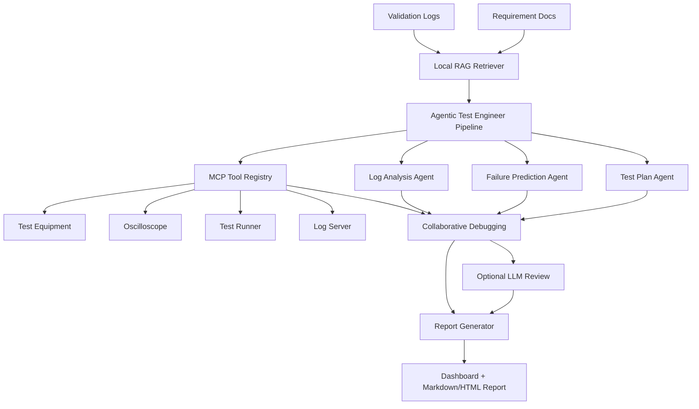

# Architecture



## Optional LangGraph Runtime

The default pipeline is dependency-light and deterministic. For a real agent-orchestration runtime, install optional dependencies and set:

```powershell
pip install -r requirements-optional.txt
$env:AI_COPILOT_USE_LANGGRAPH="1"
python server.py
```

When enabled, `app/langgraph_workflow.py` runs the same workflow as a LangGraph `StateGraph`:

```text
build_knowledge -> collect_tools -> generate_tests -> predict_failures
-> analyze_logs -> debug_failure -> review_with_llm -> generate_report
```

## Agent Responsibilities

- TestPlanGeneratorAgent: converts requirements into validation-ready test cases.
- FailurePredictionAgent: identifies critical components and likely failure modes.
- LogAnalysisAgent: extracts failure evidence and assigns a root-cause hypothesis.
- CollaborativeDebuggingAgent: simulates hardware, firmware, validation, and root cause expert review.
- ReportGeneratorAgent: creates Markdown and HTML debugging reports.

## MCP-Style Tool Layer

The mock registry in `app/mcp_tools.py` models tool discovery and tool invocation:

- `test_equipment.health`
- `oscilloscope.capture_summary`
- `test_runner.loopback`
- `log_server.failure_window`

In a production version, those handlers can be replaced with real MCP Python SDK calls to lab equipment, log storage, CI systems, or internal documentation.

## RAG Layer

The local retriever chunks specifications and logs, tokenizes them, computes small TF-IDF style scores, and attaches source references to generated test cases, risk predictions, and findings.

It is intentionally dependency-free so the demo works anywhere. ChromaDB, LlamaIndex, or LangChain can replace this module without changing the agent interface.
